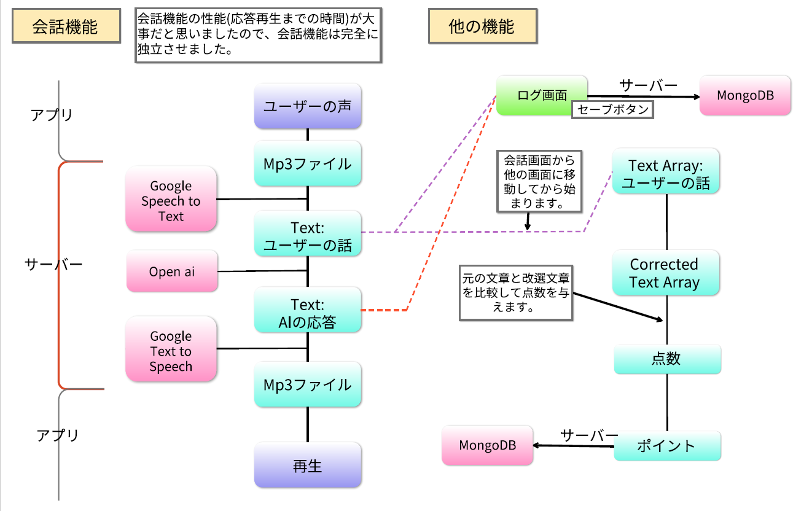
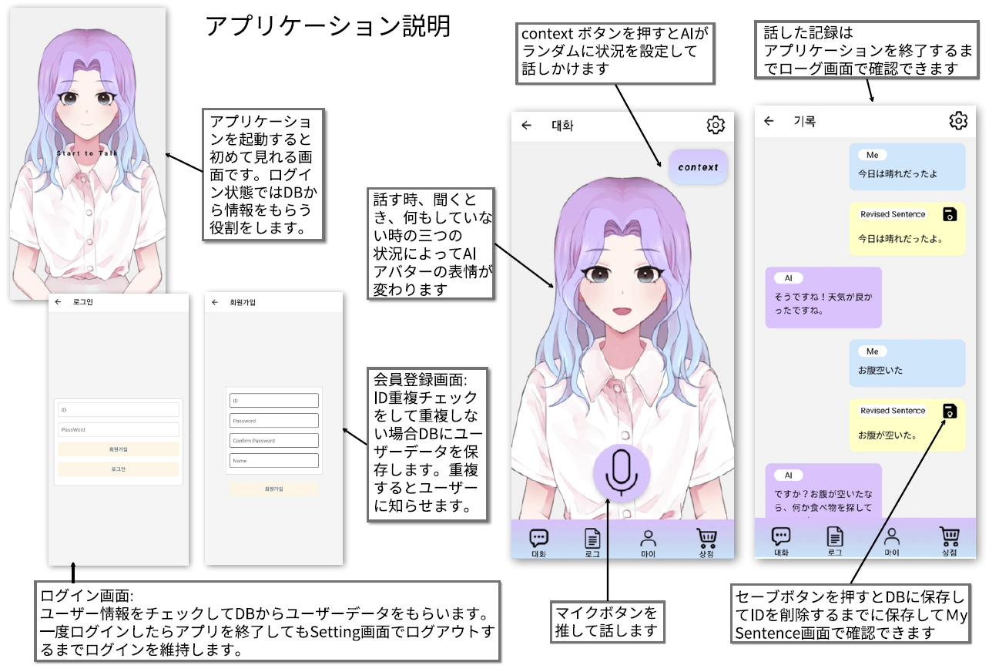
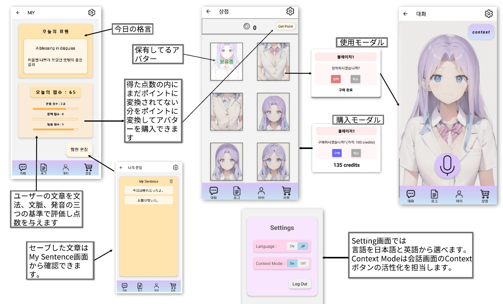
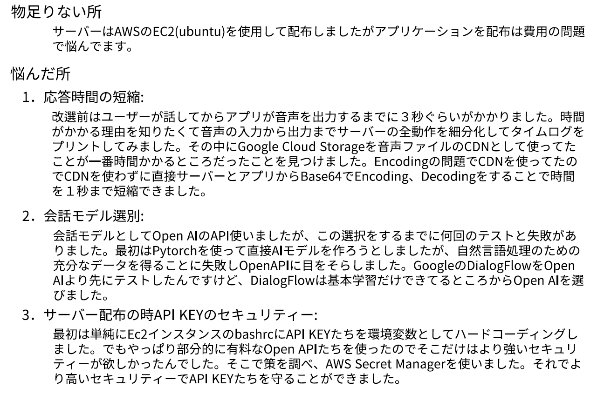

# **AI Conversation Application**

### 開発目的: 
#### 現在韓国で使える会話AIアプリケーションは英語のみをサポートしているため、Open AIとGoogle Cloud PlatformのAPIを活用して、日本語もサポートする対話AIアプリケーションを開発してみました。
#### 2023.03 ~ 2023.06
#### Used Skills: React Native, Flask, MongoDb, Ec2, AWS Secret Manager, 
#### Used OpenAPIs : Open Ai, Google Cloud Speech to Text, Google Cloud Text to Speech 

